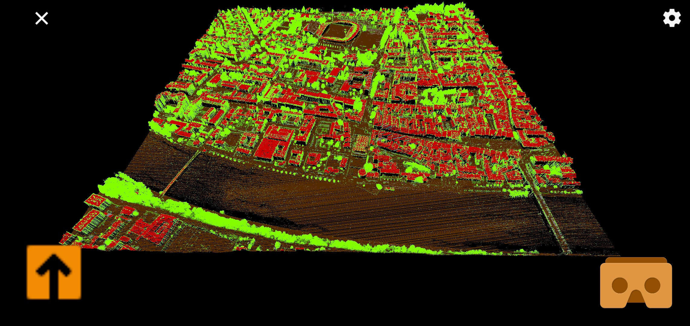
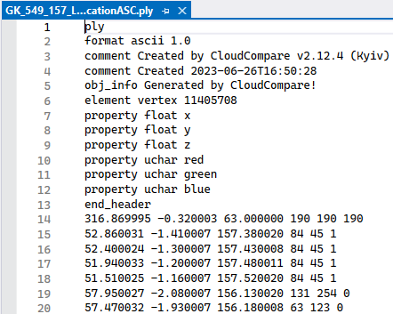

# Interactive visualization of LiDAR point clouds on virtual reality glasses using a smartphone

The implementation of a mobile application for the Android operating system, which displays a cloud of Light Detection and Ranging (LiDAR) points on a smartphone.
The application enables movement in virtual space and, when visualizing points with the help of Virtual Reality (VR) glasses, it enables a more convincing experience of the real environment.

## Installation
- clone repository
- add root folder "LiDAR-visualization-in-VR-on-smartphone" to Unity Hub
- open the project
- provide your own cloud of LiDAR points -> **file must be in a BINARY format .ply**
-- you can use [CloudCompare](https://www.danielgm.net/cc/)
-- translate, rotate and scale LiDAR point cloud if need be (Unity uses different axis, coordinates shouldn't be too big)
-- save it to binary .ply
-- aplication only support reading XYZ coordinates and RGB values (for better understaning look at provided image with ASCII .ply)

- import .ply to Unity project
- click on it and select "Container Type" to "Mesh" (already installed PCX package from [Keijiro](https://github.com/keijiro/Pcx))
- drag imported file into the scene "LiDAR VR" (if you don't see point cloud, double click the object in hierarchy)
-- if you still don't see it, go scale/shift coordinates down with CloudCompare
- select gameobject and set MeshRenderer -> Material -> "MyPointWhite"
- select material "MyPointWhite" and set Shader -> "Custom/MyPointShader"
- connect your phone and build application on it
-- if you press Cardboard button it switches into VR mode
-- if points are too small/big -> navigate to where you set Shader -> "Custom/MyPointShader" -> locate settings below -> change "Point Size"

## Contributing

Please give credit if you want to use the project.

## License

[MIT](https://choosealicense.com/licenses/mit/)